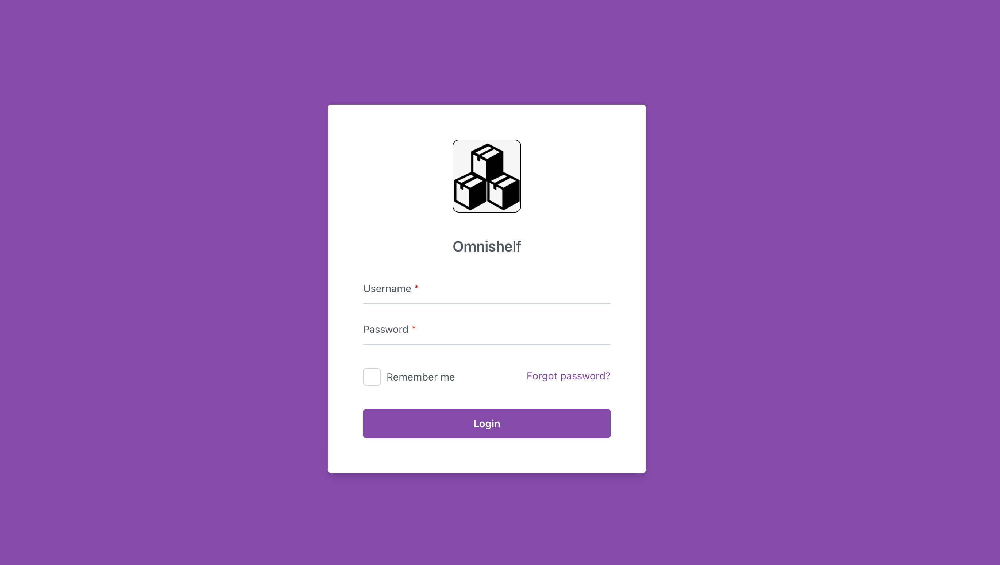
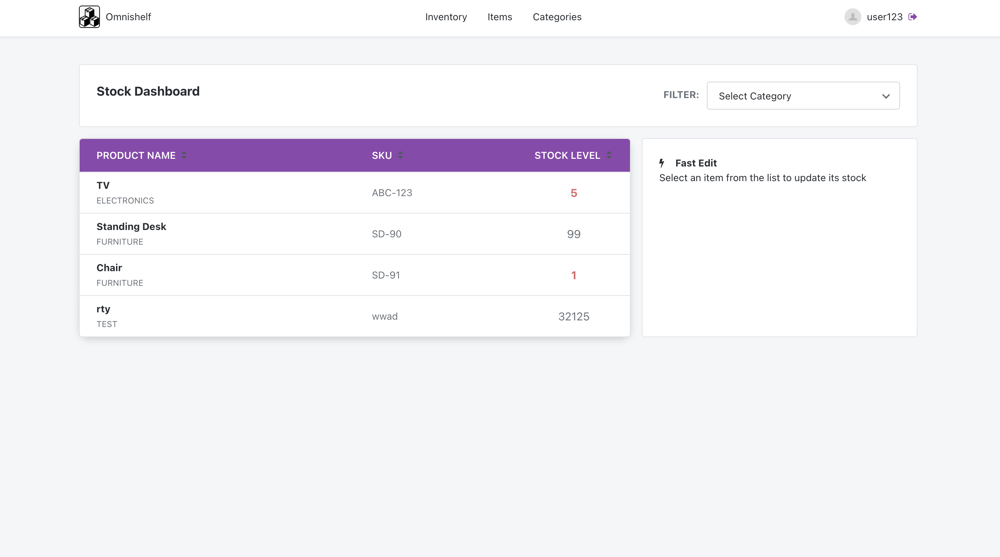
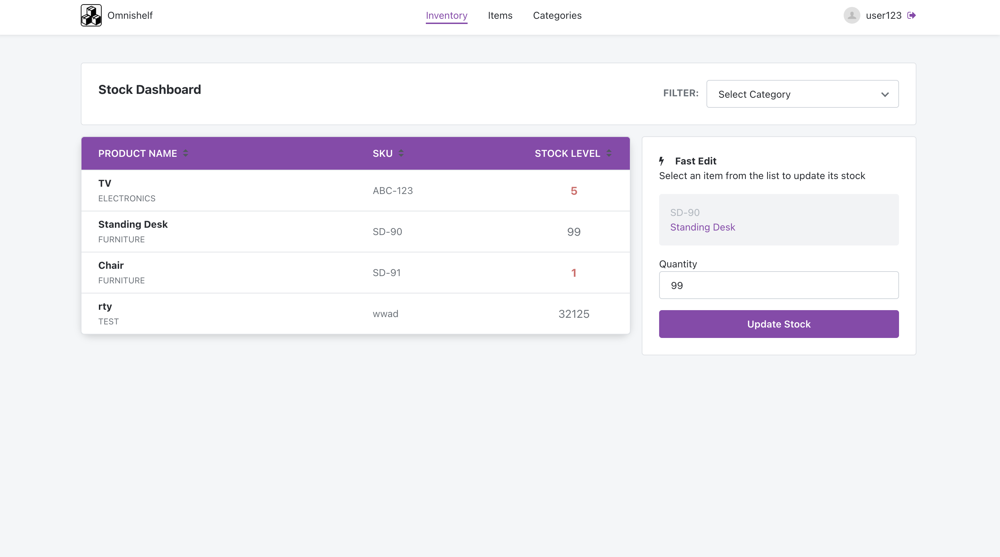
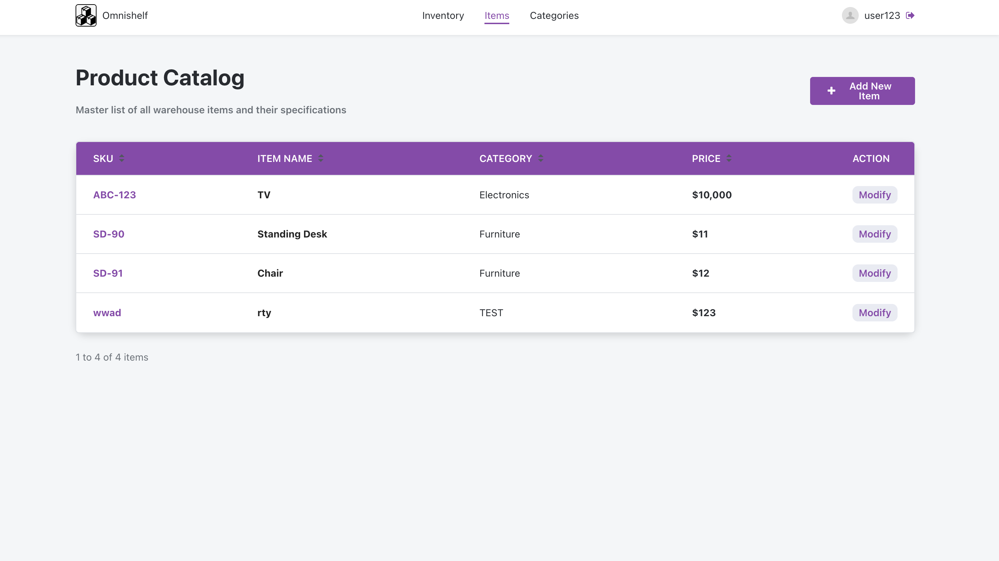
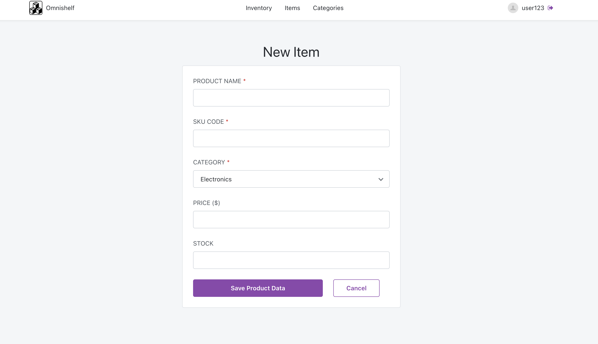
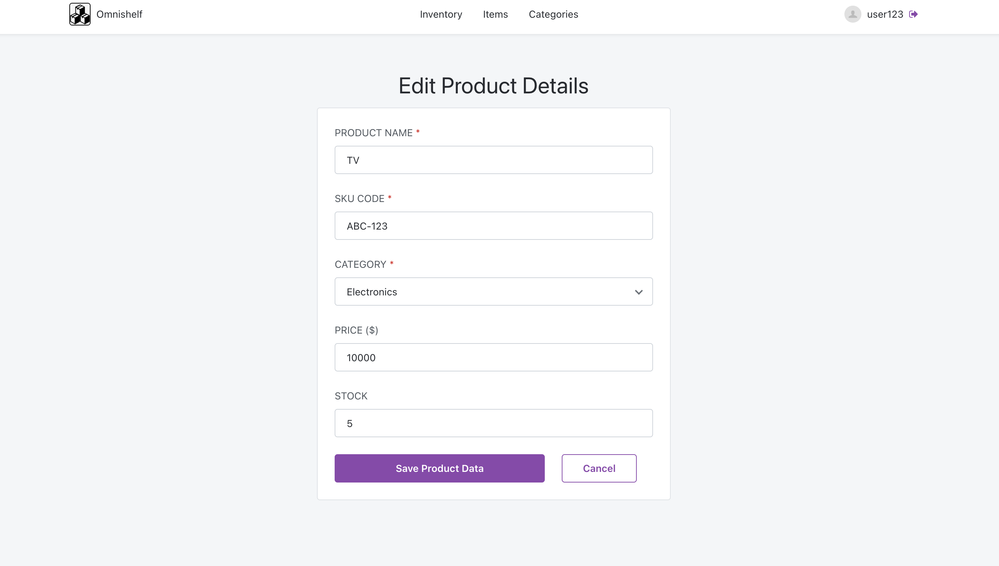
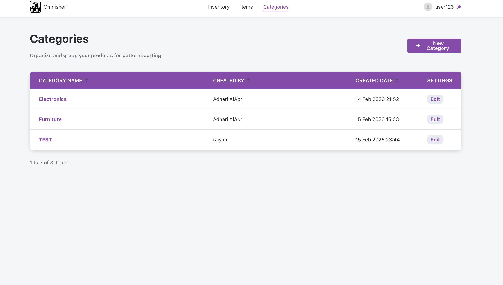
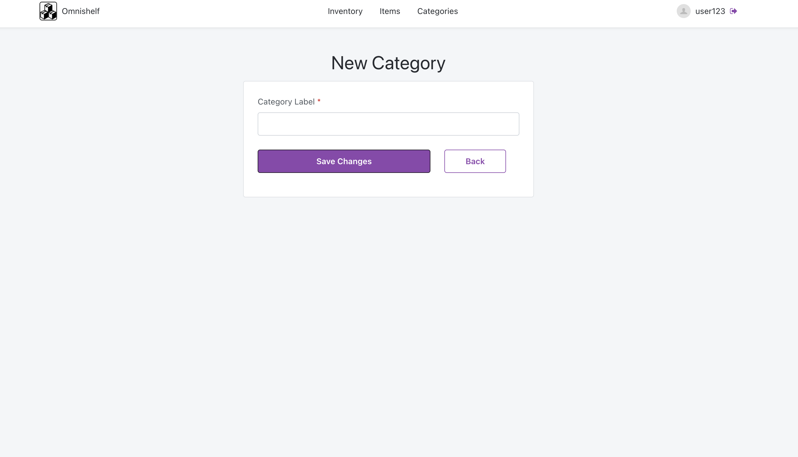

# OutSystems Inventory Management System (OmniShelf)

A modern **Inventory Management System** built with **OutSystems** that enables businesses to efficiently organize products, manage categories, monitor inventory levels, and update stock in real time through a clean and intuitive interface.

---

## Live Demo

**Website:** `https://your-website-url.com](https://personal-vakhoryl.outsystemscloud.com/Omnishelf/login`

---

## Demo Credentials

| Role | Username | Password |
|------|----------|----------|
| Demo User | `user123` | `user1234` |

---

## Screenshots

### Login

### Inventory Dashboard

### Fast Stock Update

### Product Catalog

### Add New Product

### Edit Product

### Categories

### Add Category

---

# Features

## Inventory Dashboard
- View all products in one centralized dashboard
- Display product name, SKU, category, and current stock
- Highlight low-stock items for easier monitoring
- Filter inventory by category
- Instantly select products for editing

---

## Fast Stock Updates
- Update stock quantities without leaving the dashboard
- Select any product directly from the inventory list
- Real-time inventory updates
- Simple and efficient workflow

---

## Product Management
- Add new inventory items
- Edit existing products
- Assign products to categories
- Store SKU, product name, category, price, and stock quantity
- Clean product catalog with sorting support

---

## Category Management
- Create product categories
- Edit existing categories
- View category creator
- Track creation date
- Organize products for easier inventory management

---

## Search & Organization
- Sort product and category tables
- Filter inventory by category
- Organized interface for faster navigation

---

## User Authentication
- Secure login screen
- User profile displayed in the navigation bar
- Logout functionality

---

# Getting Started

1. Open the application.
2. Login using the demo credentials.
3. Browse the inventory dashboard.
4. Create categories.
5. Add new products.
6. Edit existing products.
7. Update stock quantities using the Fast Edit panel.

---

# Key Functionalities

- Inventory Dashboard
- Fast Stock Editing
- Product CRUD Operations
- Category CRUD Operations
- Category Filtering
- Product Sorting
- Stock Monitoring
- Responsive Interface
- User Authentication

---

# Future Improvements

- Barcode/QR Code support
- Product image uploads
- Inventory analytics dashboard
- Export inventory to Excel/PDF
- Low-stock notifications

---

# Author

**Adhari Al-Abri**
